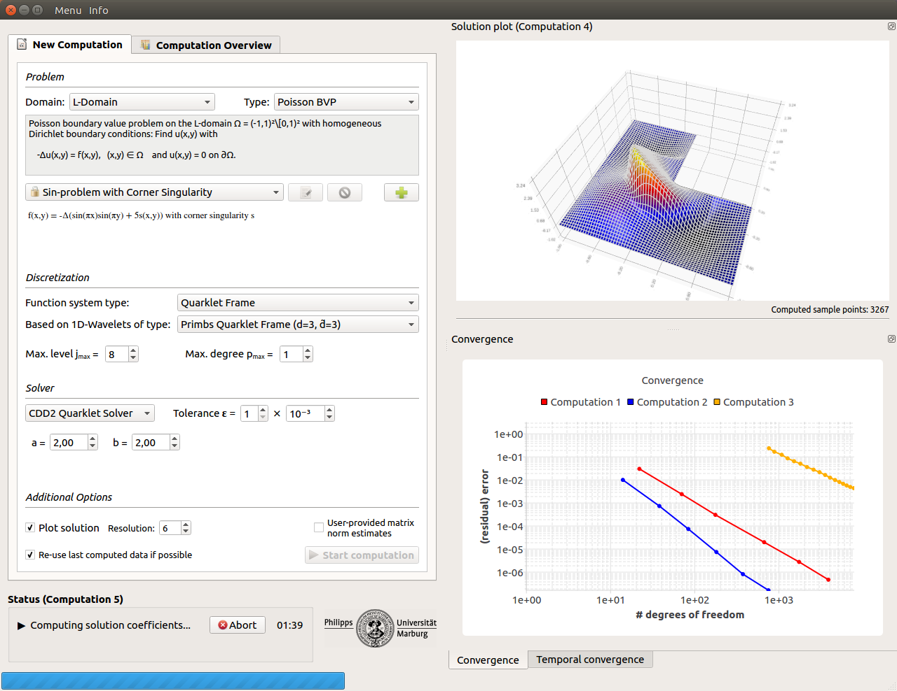

# MSL GUI

*MSL GUI* is a Graphical User Interface (GUI) for the *Marburg Software Library* (MSL) that runs under Linux and Windows. The MSL is a collection of template-based C++ code for adaptively solving (partial) differential equations using a discretization with Wavelets. In the past, defining a problem and a Wavelet-system for discretization and solving it with the desired algorithm required writing a small C++-program, which then only had text-output and did not allow any user interaction. Solution and convergence data was only accessible via Matlab-files, which were generated by the program. Furthermore, changing a parameter of the computation required recompilation of the whole program, which (because of the many template instantiations involved) could take some time.

*MSL GUI* now allows to comfortably choose between a number of different problem types, Wavelet-systems, solvers and related parameter values via a graphical user interface. Convergence data is live-plotted during the computation process and computations can be aborted (almost) anytime. Solution plots are directly shown by the program and solution/convergence data can be exported to Matlab-files anytime after the computation (this is even possible in case of an incomplete/aborted computation).  
New problem definitions (in the form of function expressions for the right-hand side and - if applicable - coefficient functions) can be added during runtime, exported to/imported from an XML-file and can be solved without recompilation. Evaluation of user-defined functions is done by means of a fast math parser library (see *muParser* in the credits section).

The program was developed using the *Qt* application/GUI-framework. It encapsulates all dependencies from the MSL in a Qt-plugin (mslgui_plugin), which is loaded as a shared library. The GUI can be extended by new problem types, Wavelet-systems and -solvers quite easily without any knowledge about GUI programming. A documentation on how to do that will follow in the near future.

## Build and run MSL GUI (Linux and Windows)

1. Download the Open Source version of the Qt-framework at [https://www.qt.io/download](https://www.qt.io/download).
2. After starting the online-installer you can skip the step of creating or logging in to a Qt account.
3. Select to install the latest Qt-version (at least Qt 5.10). It suffices to install the prebuilt components for your platform (for example *Desktop gcc 64-bit*) and the *Qt Charts* and *Qt Data Visualization* module. We also recommend to install the IDE *Qt Creator* under "Tools", which is checked by default.
4. Start *Qt Creator*, click on "Open Project" and select the file *MSL_GUI.pro* in the MSL_GUI/sources folder to open the MSL GUI project (note: the full path to the project files must not contain any spaces!)
5. When opening the project for the first time, it must be configured by selecting a *Kit*, which stores a build-configuration. The default Kit should be okay, so just click on "Configure Project" (if not, click on "Manage Kits..." and then "Add" to define a new one).
6. Click on the computer icon in the left bottom corner and select *Release*.
7. Click on the hammer icon (or press Ctrl+B) to build the project. Because of the large number of template instantiations involved, this may take some minutes.
8. After the build process is finished, you can start *MSL GUI* by clicking the run icon or pressing Ctrl+R in Qt Creator or by just launching the executable file *msl_gui* in the Release-folder.

### Troubleshooting

When getting a compiler error under Linux, saying that file *GL/gl.h* does not exist, just execute the following command:

    sudo apt-get install mesa-common-dev libgl1-mesa-dev

## License

Copyright (c) 2018, Henning Zickermann  
*MSL GUI* is licensed under the GNU General Public License version 3, see the file  for details.

## Warranty

*MSL GUI* is distributed in the hope that it will be useful, but **WITHOUT ANY WARRANTY**; without even the implied warranty of **MERCHANTABILITY** or **FITNESS FOR A PARTICULAR PURPOSE**. See the GNU General Public License for more details.

## Credits

*MSL GUI* gratefully makes extensive use of the following open source software projects:

* [Marburg Software Library](https://github.com/wavelet-and-multiscale-library/Marburg_Software_Library), Copyright (C) 2002-2018 Thorsten Raasch, Manuel Werner and many other contributors - MIT License
* [Qt GUI Toolkit](https://www.qt.io/), Copyright (C) 2018 The Qt Company Ltd. and other contributors - GNU General Public License version 3
* [muParser](http://beltoforion.de/article.php?a=muparser), Copyright (C) 2016 Ingo Berg - MIT License
* Humanity Icon Theme, Copyright (C) 2009 Daniel Foré, K.Vishnoo Charan Reddy, Jonian Guveli - GNU General Public License version 2

